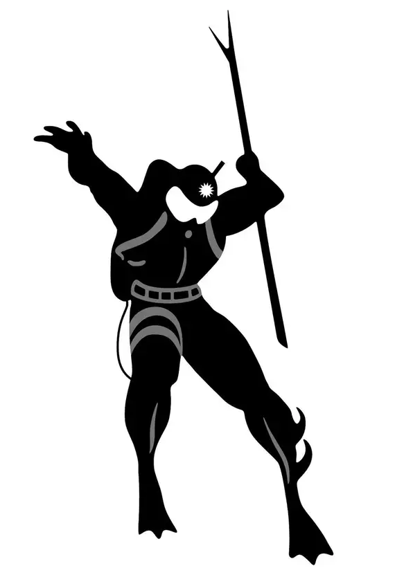
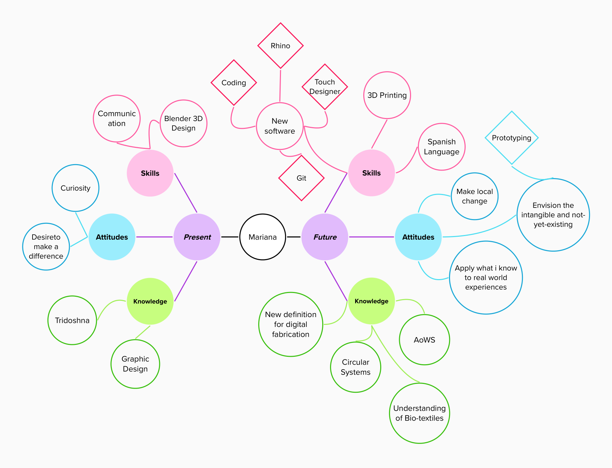

---
hide:
    - toc
---

# Bootcamp

### **"My Fight" Poster**

The above image displays a Drexciyan soldier. Drexciya was an electronic music duo composed by James Stinson and Gerald Donald, musicians that digitally synthesized futuristic-sounding music in response to Detroit's post-industrial gloomy environment of the early 80s. Trying to move away from the common narrative of suffering, present in racially-stigmatized genres such as rap and R&B, the duo produced music that envisioned a radically different scenario for black people in America. Their music thus narrates the adventures of the Drexciya tribes, which ruled both space and underwater environments. While I do not belong to a racial minority, Afrofuturism was the closest thing I found to represent my desire to embody and resignify socio-cultural emerging digital movements. My fight is a desire to recreate and innovate our hopes for the future. Like the Drexciyan duo, I am not satisfied with the popular narrative that our society is at a destructive point of no return. What I believe, is that we have to restructure our systems of knowledge and institutional practices in order to create a somewhat positive narrative for future generations.

### **My Mindmap**

This mindmap highlights my present and futurely desired skills, knowledge, and attitudes.
