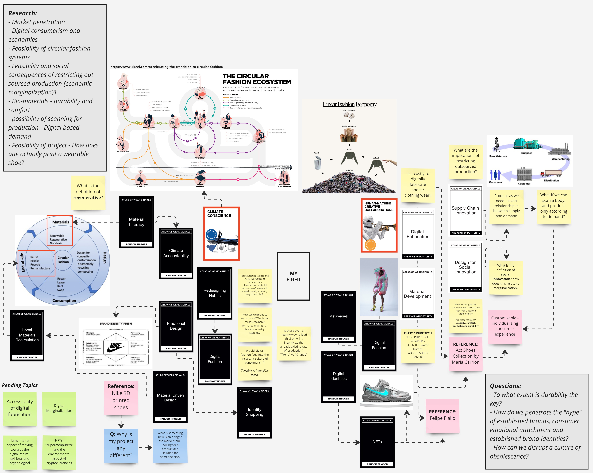

---
hide:
    - toc
---

# Atlas of Weak Signals

### **My Design Space**

My Design space seeks to bridge the gap between two weak signals: Climate consciousness and human-machine creative collaborations. By looking into the niche market of sneaker production and distribution, I hoped to dig into the specifics of supply chains, fabrication methodologies, and consumer cycles in order to understand how could I develop an innovative sustainable product within this market. When choosing a personal “fight”, I related to Afrofuturism and its technological reinvention of present futures. This involves asking the question of how one understands current socio-cultural paradigms in order to create new ones. My Design Space thus seeks to understand how can we use human-machine creative collaborations, such as in digital fabrication, biomaterials, and 3D printing to create a sustainable product which pushes towards sustainable and conscious consumerism as a norm.

With a background and interest in 3D modeling, I began this design space with a product in mind: 3D-printed shoes. As a consequence, I picked material development, supply chain innovation, design for social innovation, and digital fabrication as my areas of opportunity. My superficial idea was to use sustainable and locally-sourced materials such as recycled and bio-materials to digitally fabricate shoes using 3D printing. Yet, as I began to ask questions, I realized such a project has a lifetime of implications such as, what would happen to outsourced production economic systems if localized production became the norm? To what extent do “new products”, regardless of their sustainable practices, only feed into a culture of incessant consumerism and obsolescence? On that note, I then began to think about a digital line of products such as NFTs. Yet this also rose questions such as: what are the environmental effects of consuming in the metaverse? What about digital marginalization? As I began to dig deeper into the markets of fast fashion, circular economies, and climate consciousness in relation to material fabrication and distribution, I realized that these are complex networks with endless room for inquiry.

Overall, as I find myself in a position of ignorance, I realize it becomes increasingly hard to genuinely speak of my design space as a space for affirmations. It has thus become a place for me to wonder. At its last stages, as I asked advice from a staff member at FabLab Bcn, she simply responded “I think 3d printed shoes are sort of ridiculous. There really isn't anything new here, you are just using technologies to keep everything as it is”. That is when I realized that I still have much to learn and speculate, in order to transform my design space into a realm of tangible action. My design space thus seeks to provide for open-ended inquiries into fields of innovation within fashion systems; most specifically, the elaboration of footwear. Trying to stick to my “initial fight”, I am thus trying to understand how I can resignify current consumerism standards in order to strive towards sustainable production and conscious consumption of shoes.
