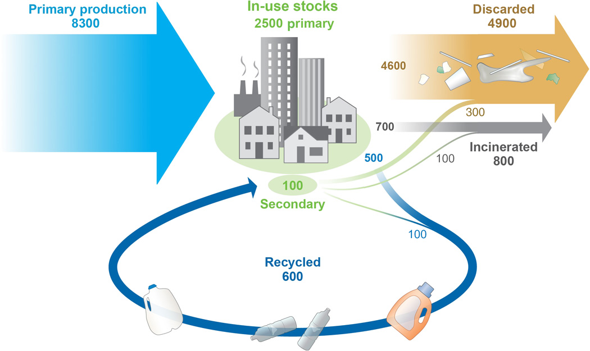

---
hide:
    - toc
---

# Bio & Agri Zero

### **Reflection - Educational systems and sustainability**

This week, during our BIO and AGRI ZERO module, we learned about microbiological systems and the modern-day development of primary sector agricultural practices. Maintaining the common theme of sustainability, both Nuria and Johnathan spoke of matters involving circular biological systems, DIY experiments, and self-sufficient agro practices which all converged to highlight the subject of what Jonathan described as “meta-design”, thus the system within systems. Personally, this week's intellectual and practical exercises brought within themselves the insistence of rethinking current systems and using action as a vehicle for change.

Interested in the practical experiment of developing bioplastics, alongside the genetic modification of microorganisms and our visit to the MATERFAD, I first began to look into articles pertaining to ‘plastic-eating’ organisms as a means of decomposing waste. That’s when I ran into the Forbes article ‘The race to develop plastic-eating bacteria’ by Scott Carpenter. The article spoke of bacteria that are able to biodegrade PET plastic
