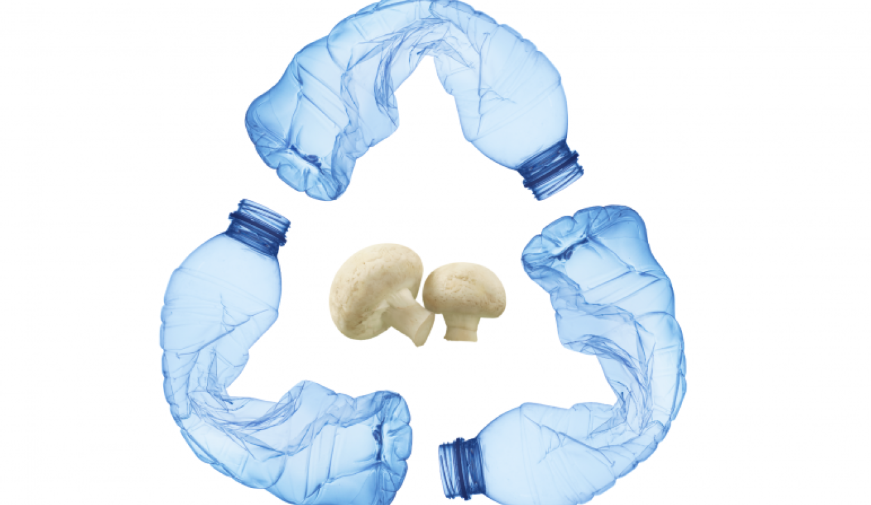

Reflection - Educational systems and sustainability

This week, during our BIO and AGRI ZERO module, we learned about microbiological systems and the modern-day development of primary sector agricultural practices. Maintaining the common theme of sustainability, both Nuria and Johnathan spoke of matters involving circular biological systems, DIY experiments, and self-sufficient agro practices which all converged to highlight the subject of what Jonathan described as “meta-design”, thus the system within systems. This week's intellectual and practical exercises thus brought within themselves the insistence of rethinking current systems and using action as a vehicle for change.

When I began this week’s reflection, Interested in the practical experiment of developing bioplastics, alongside the genetic modification of microorganisms and our visit to the MATERFAD, I first looked into articles pertaining to ‘plastic-eating’ organisms as a vehicle for decomposing waste. That’s when I ran into the Forbes article ‘The race to develop plastic-eating bacteria’ by Scott Carpenter. The article spoke of bacteria that are able to biodegrade PET plastic. Yet, “In order to make any of these naturally-occurring bacteria useful”, meaning they would break down significant amounts of PET material, “they must be bioengineered to degrade plastic hundreds or thousands of times faster”. This is explained to have ethical concerns related to the genetic modification of naturally-occurring beings, and also potentially hazardous effects for microbiomes in general. Nonetheless, the overarching issue is that even with such biotechnologies, these processes of biodegrading waste would not matter if societies are unable to properly recycle material, and differentiate our waste between recyclable and non-recyclable plastics.

On a different note, Jonathan referred to Fukuoka’s “one-staw revolution” when speaking of agricultural self-sufficiency and maintenance practices. According to ‘The Philosophy of Masanobu Fukuoka’, an article published by the Permaculture News, Fukuoka preaches against active intervention in biological rhythms. According to the article, “Rather than attempting to solve ‘problems’ through actions – new interventions to ‘fix’ things – he began to adopt a more ‘subtractive’ approach”. In this case, he sought to substitute action for inaction. Yet, to what extent is that an optimal solution for the degradation of toxic waste? Rob from MATFAD spoke of mushroom species that have evolved towards “plastic bioremediation properties”. Hereby we can see how it is important to diverge from the common deceiving narrative of sustainable practices, and no “one size fits all” measure to our ever-growing rate of consumption and consequential waste production.
