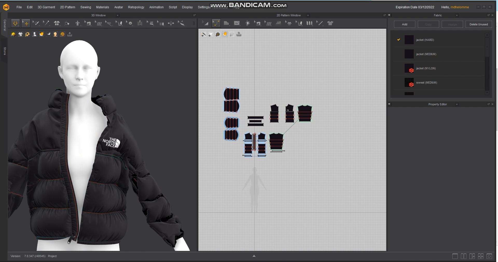

---
hide:
    - toc
---

# Living With Your Own Ideas

### **Reflection - 1st Person Intervention on Virtual Fashion Systems**

*What did you make and why did it matter?*
In an attempt to deepen my understanding of brand identities and emotional materialism, my intervention involved the act of purchasing and dressing a garment virtually. I wanted to understand both the feasibility and emotional repercussions of trying on clothing digitally.

This served as an experiment to reflect on the context of “metaverse” identities and digital embodiment. I also wanted to depict what it would feel like to try clothing virtually for physical purchases, speculating about the idea of distribution in accordance with demand, versus the current paradigm of demand based on supply. This matters because we are undoubtedly riding a wave toward digital materialism, and it is important to break down what that means for future societies and how we can dive into this transition as sustainably as possible.

*What happens when you involve yourself?*
What I realized, is that when you involve yourself in an experiment taking a first person perspective, you move beyond the speculative. The experience that one will acquire from an autoethnography is personal, yet nonetheless valid. It created questions that I probably would not have asked if I had looked at the issue through an observer perspective.

*Did anything change about the way you were working?*
Yes, everything. In the first place, I realized how much this project was related to aesthetics over anything else. For example, my initial idea was to digitally fabricate the North Face jacket. After a few hours of work, and not much improvement, I decided to use the ready-made .obj file on my avatar render. I’ve wanted a warm puffer jacket for a while, and it might have made sense to own one virtually. That's when I realized I actually wanted the product for its physical components: warmth. While the experience of dressing anything was in fact intriguing, I missed the tactile features of trying out tangible materials, where I take into account touch and weight. In order to understand to a deeper extent what that meant, I decided to download another garment; a Balenciaga-inspired blazer. I actually enjoyed virtually dressing this garment more than the first one. I thought it looked aesthetic; I wanted to play with it and make my own version of it. This also made me reflect on brand identities and how virtual fashion experiences reflect high-end fashion consumerism in the sense that they are both deeply related to aesthetics. In this case, it seems that how one feels depends on how one looks, and not in fact on the materials involved. I then wonder, what might this mean for VR acquisitions? Can we in fact use virtual components to aid tangible distribution practices? Would it be an effective consumer experience?
