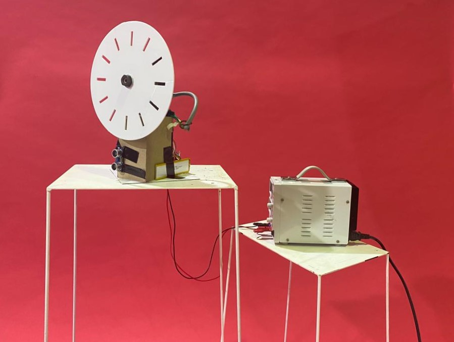

---
hide:
    - toc
---

# Tech Beyond the Myth

## **The "Distracted Timer"**

### Final Video

### [Forensic Report](https://hackmd.io/s/HJBEvhPBo)

### [Group Presentation](https://hackmd.io/s/HJBEvhPBo)

### Personal Reflection - Learning by Accomplishments and Failures

Learning by Accomplishments and failures

Tech beyond the myth, personally, was a challenging week regarding both its task and methodology. I have never had any experience with hands on machine engineering, meaning that prototyping a “almost useless machine” was very challenging in the sense that I had to adopt a learn-as-you-go methodology. With very little experience in coding, and an academic notion of design, it was imperative that I let go of determined hopes for the final product, trying to guide the machine and its functionaliites rather than set a finite and absolute expectation for what it could and would do. This shift in way of designing was a challenge at both a personal and group level. This is because all of our members had different expectations according to their personal skills sets, be it mechanical engineering, coding, design or project management. Nonetheless, the obstacles we encountered along the way were themselves lessons which redesigned our critical design processes.

*Accomplishments*

Our final prototype turned out very different than our initial proposal, yet through experimentation with Arduino and our machinery, we believe to have come up with something more creative and interactive than expected. We were able to collaborate and reiterate on new ideas whenever we encountered drawbacks with our prototype. Every obstacle, as frustrating as they were, guided us towards a different way of designing. This meant looking at our initial objectives with different lenses, and letting go of stubborn expectations for what our prototype was “meant” to accomplish. Even though the final product of the “distracted timer” did not “work” until the last minute, where we encountered issues with coding, misdiagnosis of mechanical processes, and aesthetic drawbacks, I I believe the process to have been a success. Our true accomplishment was to have re-framed our conception of design, where we worked with the technologies available, rather than having them work for us.

*Failures/Challenges*

What hindered our project, none-the-less, was our stubbornness related to our traditional conception of design. We tended to become frustrated when some things wouldn't function as according to plan, and also misinterpreted a few glitches along the way, blaming our code for what were actually mechanical issues. Also, we came to realize how choices related to aesthetics hindered the mechanical and objective funtionalitites of our prototype. Sometimes it was hard to let go of certain expectations for the prototype, which I believe to have been our greatest challenge. Nonetheless, the process of frustration, alongside aid from our colleagues and staff, forced us to continuously think outside the box to achieve a working prototype.

*Conclusion*

At the end, we did in fact accomplish what we initially set ourselves to do: a machinery which represented human sentiment. The “distracted timer” was then a success, where it represented a distracted and distraught individual by moving as a response to motion sensed by ultrasonic sensors.
