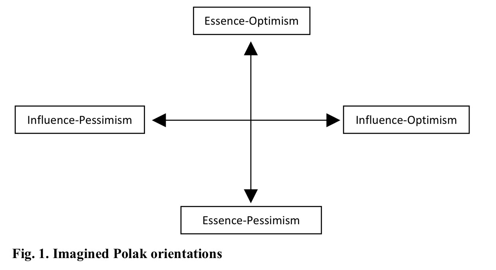
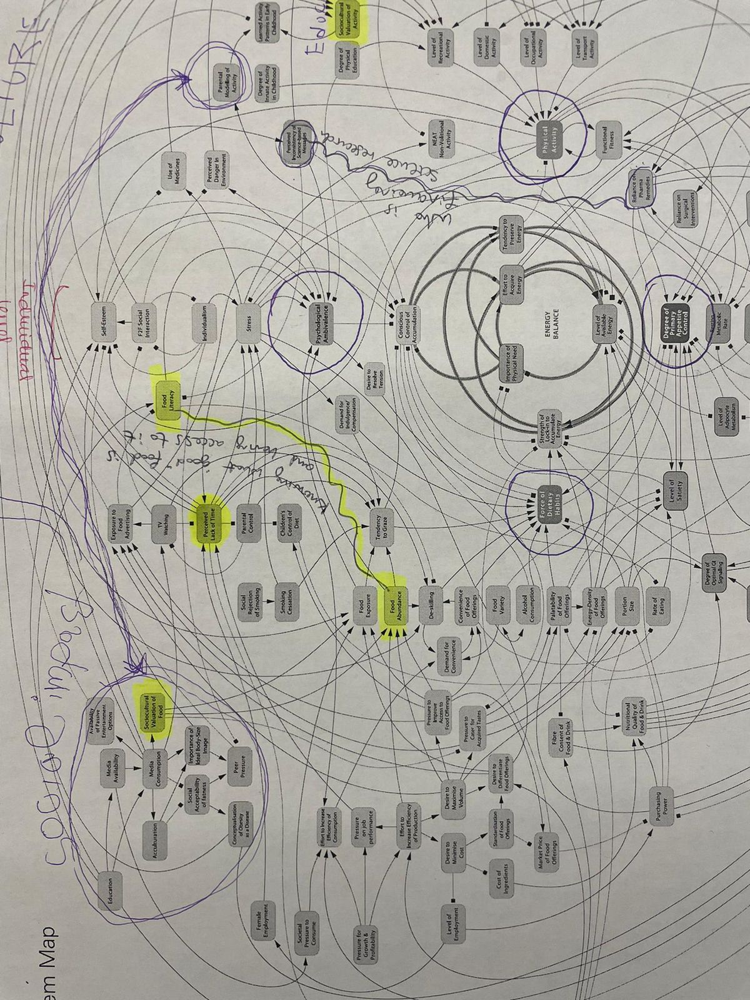
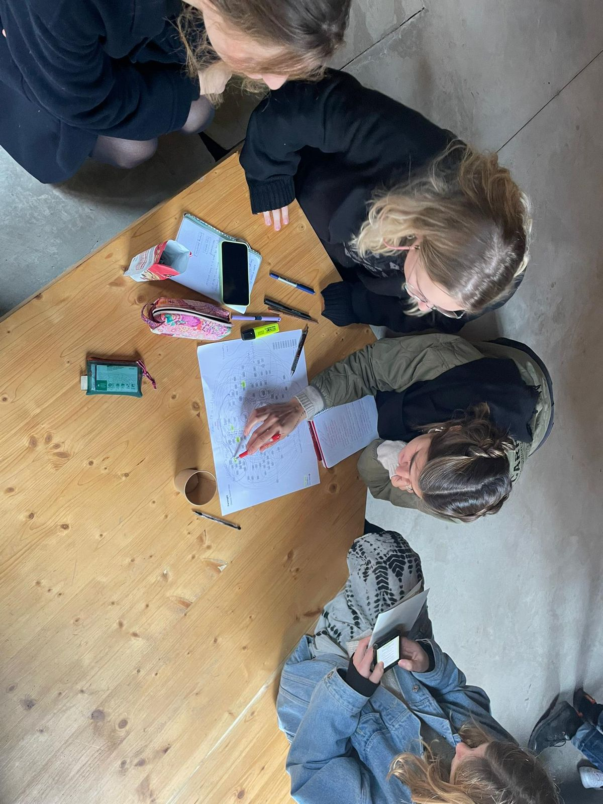

# Community Engagement

### Reflection

When thinking of Polak’s game (Hayward & Candy 2017), I find myself in the Lower Right corner. Personally, I believe things are getting worse, following an entropic nature of things. Nonetheless, I also believe that we should act to “avert disasters”. 

The community engagement lecture series was very intriguing, and I really appreciated the large number of references referred to when speaking of design. Design sometimes can seem like a somewhat abstract process, with an endless rabbit hole of questions. Nonetheless, the seminar demonstrated how small-scale community engagement is just as important when thinking about design. I specifically appreciated the topic “framing complex systems by behavior structures”, where we spoke about being over-resourced, meaning we can choose to funnel by elimination or layer by assimilation. I am personally interested in digital systems and bio-algorithmic tools, such as “wearables” and virtual reality digital experiences. Right now I find myself confused as to how to engage in an optimistic approach to digital tools, as I believe those to incur problems of accessibility, sustainability, and digital marginalization. The lecture then shifted my perspective, where maybe I could find small-scaled community solutions, layering by assimilation, rather than trying to wrap my head around a black-boxed system that seems to thrive on elimination. Overall, I enjoyed reflecting on current paradigms of power and social capital in terms of community engagement rather than large-scaled pessimism.

### Group Exercise

Depicting causes for obesity in the UK in terms of design.

### Exercise - Creative Communities

**Creative Community**

Environmental Friendly Gardening

**Context**

“The Milieuvriendelijktuinieren project” is a government-financed project which aims to encourage “environmentally friendly” gardens. This means they use insects instead of pesticides, decomposing plants as fertilizers, and thus opt for biologically natural instruments for gardening. This allows for respectful interaction with nature, and also the cultivation of healthier and sustainable food. 

**Current situation**

Currently, the project continues to grow. Even though it is no longer a funded project, this community of slow gardeners seems is said to expand throughout the Netherlands, in various locations. This is an organic process, considering the project no longer holds an updated website. 

**Engagement & Limits**

As ideal as natural gardening may be, it does hold a few limitations. Firstly, it must be considered that crop rotation is deemed essential for the health and maintanence of the soil, and one cycle may last as long as 6 years. Similarly, crops are aslo heavily dependent on weather condition. This means that natural gardening does not entitle one to freely choose the produce it wants to grow, rather, you would consume that which is available according to growing and climate seasons. For these reasons, alongside the time commitment and slow pace of natural gardening, it might be more convenient for one to buy readily-available produce. 

Another limitation may be the accessibility of information available for those who might me interested in natural gardening. Learning gardening is not an easy practice in itself, and natural gardening requires site-specific information (such as response to climate variations, local insects, etc) which my not be easily available to the wider public.

**Theory of change**

**Design challenges and opportunities**