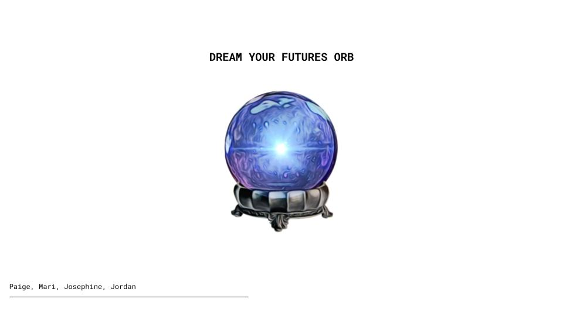
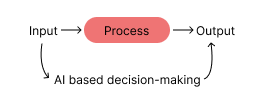
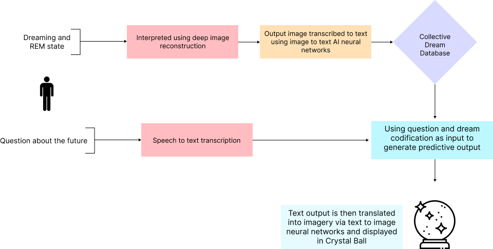

# Extended Intellligences

## The Crystal Ball Machine - A Reflection on AI

### Reflection

What is intelligence? Can we measure creativity? These were the intial questions proposed at the beggining of the seminar Extended Intelligences. While I'm still unsure of the answer to these questions, when speaking of artificial intelligences, intelligence seems to a system which intakes inputs so as to produce outputs.

It was really helpful to put such perspective into practice when speculating on a future predicting crystal ball. Our project involved a crystal ball which would predict the future by taking our users' dreams as input A, and a question about their futures as input B. As absurd as such idea seemed to me in the early stages of the project, I soon came to realize how such an idea of interpreting and digitizing dreams has already been enacted by scientists. When looking into data sets for our projects, we came across different scietific methodologies which were experiementing the visual reconstruction of dreams via brain activity, and artificial intelligences which translated text to image, and even videos. This served to show the importance of laying out inputs, activities and outputs when determining a project so as to truly visualize feasibility and the magnitude of one's own project.

