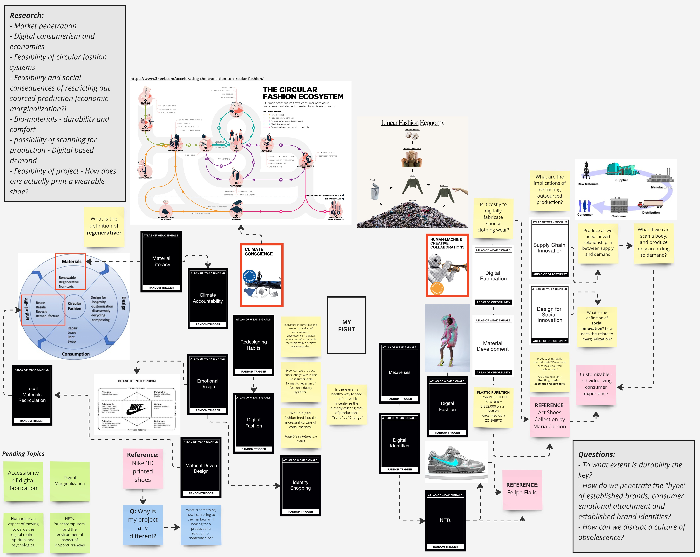

# Designing for the Next Billion Seconds

**Keywords (around 5):**
Futures, Deceiving communication and word choice, hyper-normalized, “Green Growth”, “Jevons Paradox”

**Personal Reflection**
This week, I really appreciated learning about the counterintuitive nature of “Green Growth”. In the case where eco-anxiety seems to be a norm for current generations, the narrative that there is a feasible positive correlation between economic growth and capitalist economies, and de-growth gives us a pretense for desperate hope. In contrast, we learned about critical hope, thus the idea of fragmenting your hope. Personally, I think it is challenging to practice critical hope and divorce grief from hope in some matters. I do agree with Kari Grain when he states that hope is for the privileged. Yet nonetheless, I appreciated learning about the importance of reframing world issues and our personal relationships to these matters, in terms of psychology and communication.

This course also made me rethink normative communication systems. Realizing how communication is a tool for design thinking, I couldn’t help but question: what have we hyper-normalized in our systems? What lies/false narratives do we believe in?

**Relationship to personal project?**
“We are here on behalf of others”. How can we use the concept of ancestral knowledge for the expanding future? In augmented reality, what does it mean to design for the next billion seconds? What are the “futures” I am attempting to tap into? In terms of a time capsule, what do I want to preserve for future generations, and what must be rewritten?

