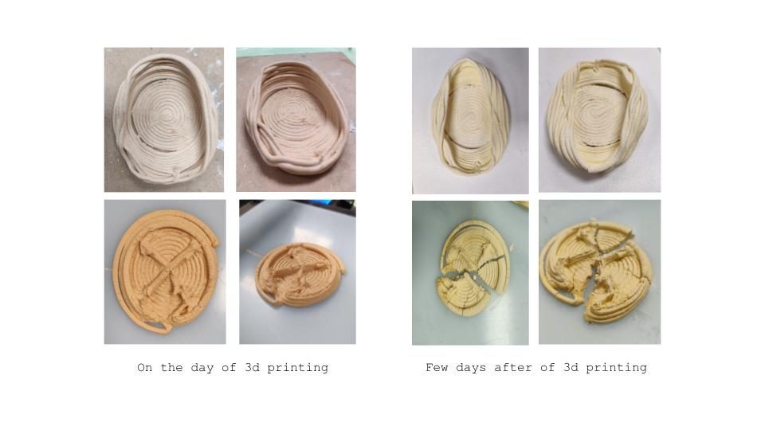
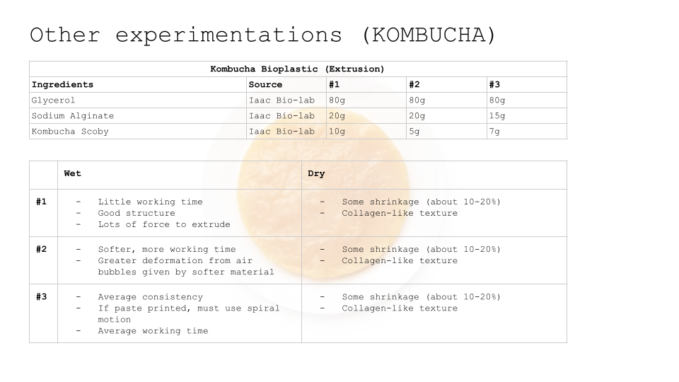
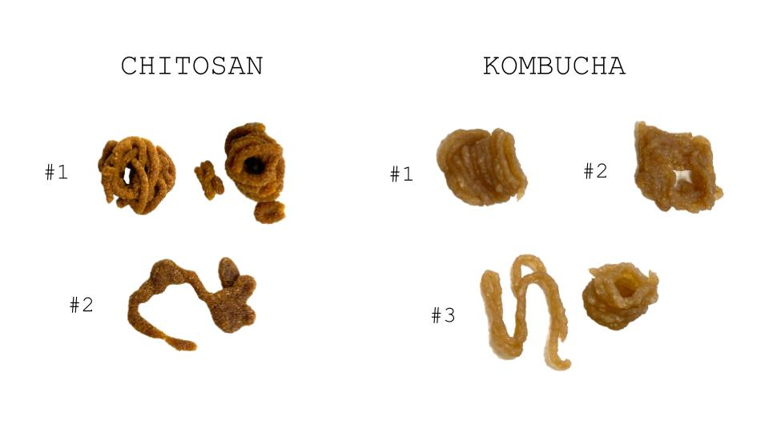
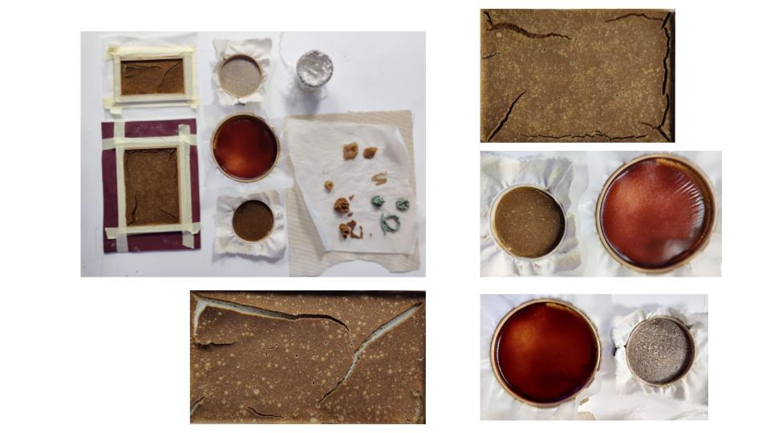
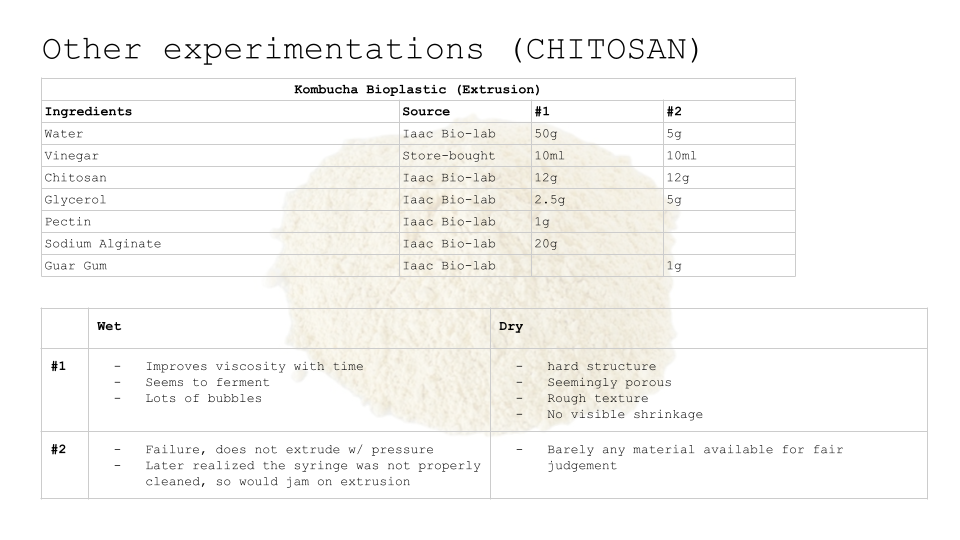

# Remixing Materials

**Professor(s): Laura, Jess, Lara**

**Keywords** (around 5): Bio-materials, Chitosan, Mycelium, interdisciplinary

### Exercise: Material Narratives

**Material Around: Calcium Carbonate**

As a vehgtarian, I eat eggs everyday, yet have always discarded the eggshells. Yet, during remixing materials, we learned that calcium carbonate could serve as an ingredient in bioplastics, and most specificaly, it could enact in an interesting recipe for paste printing. As we were specifically interested in bioplastics for digital concerns, we then experimented with paste printing using eggshells. Overall, we learned that it was a dificult material to work with due to its short working time, and the fact that paste printing did not allow for complex shapes (differently to PLA, for example).

**Material from Reference: Kombucha**

I really enjoyed working with Kombucha. I have always enjoyed the processes of growing Scobys and brewing kombucha, and I was fascinated by the garment experimentation done with Kombucha leather. I had already done cosmetics with the SCOBY material, yet using it for extrusion purposes also gave interesting results. Different to the calcium carbonate, where we used a recipe, the Kombucha extrusion was more of a trial and error experience:

**Ideal/Fictional Material: Chitosan**

