# Prototyping for Design

##Reflections

### Electronics and Coding

This class we explored the basics and extents of electronics. Personally, as someone who has never worked with electronics, it was difficult to grasp the practical uses of the theoretical knowledge presented. Nonetheless, I am exited for future projects, where I hope to truly understand the extents of electronic hardware and command-based electronics.

Following, here is the class assignment: Arduino Code and Music.

```
int buzzer = 13;//the pin of the active buzzer
void setup()
{
 pinMode(buzzer,OUTPUT);//initialize the buzzer pin as an output
}
void loop()
{
 unsigned char i;
 while(1)
 {
   for(i=0;i<80;i++)
   {
    digitalWrite(buzzer,HIGH);
    delay(2);//wait for 1ms
    digitalWrite(buzzer,LOW);
    delay(1);//wait for 1ms
    }
     for(i=0;i<100;i++)
      {
        digitalWrite(buzzer,HIGH);
        delay(2);//wait for 2ms
        digitalWrite(buzzer,LOW);
        delay(2);//wait for 2ms
      }
        for(i=0;i<40;i++)
      {
        digitalWrite(buzzer,HIGH);
        delay(1);//wait for 2ms
        digitalWrite(buzzer,LOW);
        delay(2);//wait for 2ms
      }
      
  }
} 

```

### Computer Aided Modelling and Manifacturing

Today was very interesting to me, since I am very intrigued by 3D modelling and its endless real of capabilities. I have previous experience with blender, and decided to explore it materiality tools. Following is what I was able to come up with when exploring with the generation of liquid:

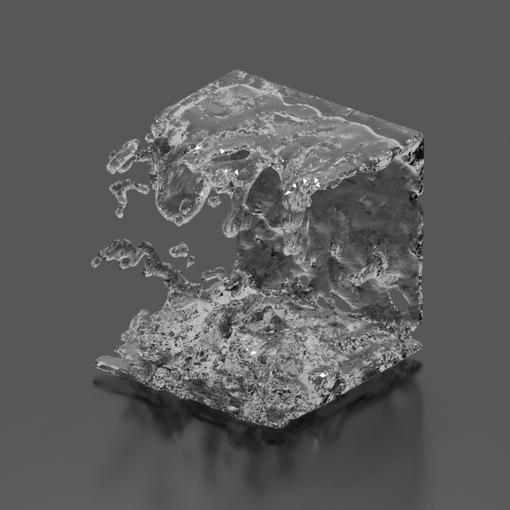

Also, here is my parametric drawing of a croissant:

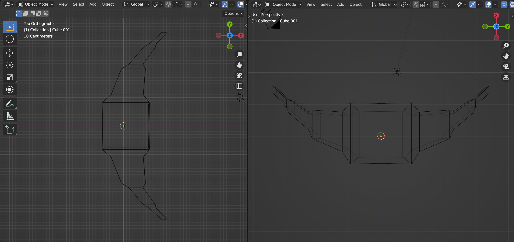

### 2D Fabrication - Laser Cutting

For the Laser Cut Project, we printed pieces of our intervention installation "The Confessional". Laser cutting, to me, was a complex experience when having to translate the lines in rhino to the machine itself. Nonetheless, to ease our process, we used the conventional parameters available at fablab for speed and power. Also, in order to waste a lesser amount of material when doing our project, we first prototyped. using cardboard, before cutting into our final piece on plywood.

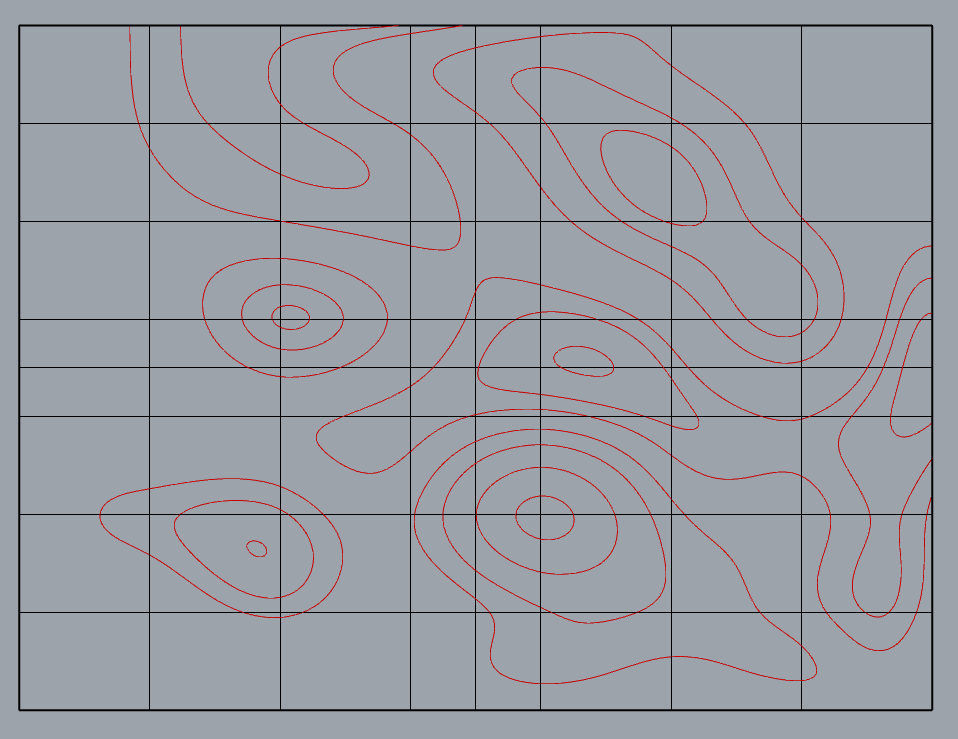

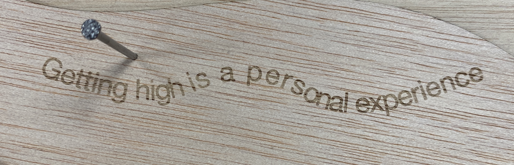

### Inputs and Outputs - Morse Code Conversations

This class we discussed the different types of sensors, how resistors work and affect the overall circuit, and the overall importance of inputs and outputs. 

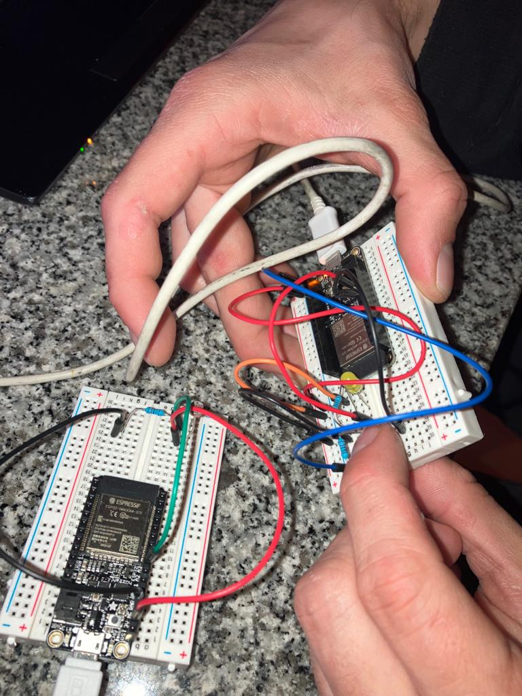

This code represents the sensor readings and how it determines an output as SHORT or LONG as according to morse code outputs represented by another system of a Blinking LED light. 

The loop function reads the value of an analog sensor connected to the the Arduino board. If the sensor value is greater than 1000, it sends a message to the serial monitor to turn off the lights and waits for one second.

If the sensor value is less than or equal to 1000, it sends a message to the serial monitor that the lights are off and checks if the LED has turned on by checking if the sensor value is greater than 100 and ledState is 0. If the LED has turned on, it sets ledState to 1 and sends a message to the serial monitor that the LED has turned on. It also sets the startTime variable to the current time using the millis() function and sends a message to the serial monitor with the start time.

The program is trying to sense blinking lights as a translation of Morse code. Therefore, if the LED turns off again, the program calculates the duration of the LED being on by taking the difference between the start time and the end time using the millis() function. It then sends a message to the serial monitor with the end time and the interval. If the interval is less than 1000 milliseconds, it sends a message to the serial monitor that the interval is short, indicating a dot in Morse code. If the interval is greater than or equal to 1000 milliseconds, it sends a message to the serial monitor that the interval is long, indicating a dash in Morse code.

```
int R2 = 10000;
float VIN = 3.0;

unsigned long startTime = 0;
unsigned long endTime = 0;
unsigned long interval = 0;

int ledState = 0;

void setup() {
 Serial.begin(9600);
}

void loop() {

 // read the input on analog pin 0:
 int sensorValue = analogRead(A3);

 if (sensorValue > 1000) {
   Serial.println("turn off the lights!");
   delay(1000);
 }

 else {
   Serial.println("lights off, checking for LED...");
   if (sensorValue > 100 && ledState == 0)  //if the led turns on
   {
     ledState = 1;
     Serial.println("the led turned on, I think!");
     startTime = millis();
     Serial.println("start time:");
     Serial.println(startTime);

     if (sensorValue < 100) {
       endTime = millis();
       Serial.println("end time: ");
       Serial.println(endTime);
       interval = endTime - startTime;
       Serial.println("interval: ");
       Serial.println(interval);

       Serial.println("The LED is back off, I think!");
       ledState = 0;
       delay(1000);

       if (interval < 1000) {
         Serial.println("SHORT");
         delay(1000);
         interval = 0;
       }

       else {
         Serial.println("LONG");
         delay(1000);
         interval = 0;
       }
     }
   }
   // Convert the analog reading (which goes from 0 - 1023) to a voltage (0 - 5V):
   //float voltage = sensorValue * (3.0 / 1023.0);

   // Get the value of R1
   //int ldr = ((R2 * VIN) / voltage) - R2;

   // print out the value you read:
   //Serial.println(sensorValue);
   //Serial.print("voltage: ");
   //Serial.println(voltage);
   //Serial.print("LDR value: ");
   //Serial.println(ldr);
 }
 
 ```

### Challenge I - Augmented Reality and Hidden Conversations

Repo: https://github.com/mdhelomme/MicroChallengeI

Project Overview:

Unfolding Conversations is an ongoing intervention that aims to create open dialogue surrounding the use of psychoactive substances in recreational environments. The project seeks to provide a non-judgmental platform for people to share their experiences and opinions on drug use in various locations, such as music festivals, bars, or universities. It combines a physical sharing board with augmented reality technology to create a unique and interactive experience that facilitates communication about a topic often considered taboo.

Key Components:

Sharing Board: The board is designed using a topography map to allow for modularity and adaptability to different locations and settings. It presents a flow of statements and questions related to drug use, and participants can engage with the board by attaching threads to nails corresponding to their answers.

Invisible Answers: To encourage honest sharing, the project includes "invisible answers" that can be revealed through an augmented reality (AR) app. These answers are printed on stickers with unique shapes and placed on the board. When scanned with the AR app, the stickers reveal more intimate and difficult statements that may be harder for participants to express openly.

AR App: The app, developed using an AR development package and ARKit, allows participants to scan the stickers and view the hidden answers on their smartphones. Currently, the app is limited to individual deployment on iOS devices and must be built through Xcode.

Project Breakdown:

We designed the board starting with a topography map to give a modularity aspect and not to limitate ourselves to a squared board. Also, the shapes of the topography allow us to build on to different shapes and adjust the board according to our preference.


Once the shapes were fixed we developed a flow of answers that could represent statements related to drugs and then we placed them in the rhino file.

We first prototyped the board in cardboard to test it out and then laser-cut it on plywood. The whole board starts with a question: "Do you do drugs?" The YES and NO answers correspond to a thread and then the journey begins as a flow of answers to communicate personal opinions and experiences. Close to each answer, we put a nail where a thread can be attached as a "yes I do".


We know that being honest, with themselves and others, about drugs is not easy, so in order to allow people to feel more comfortable about sharing we came up with the idea of the invisible answers, more intimate and difficult statements that might be hard to point out in front of others. These answers were not laser cut in the board, instead, we printed shaped stickers (connected to the aesthetic of the project) on blue vinyl and then stuck them on the board.

Utilizing an augmented reality development package along with ARKit, we developed an app that enables users to individually scan each icon (stickers), subsequently displaying the "invisible answers" on their smartphones. However, the app is restricted to individual deployment, which requires us to build and deploy it on each iOS device via Xcode. As a result, the code is currently exclusive to iOS builds.

Ultimately, each participant can experience an open and inclusive space for sharing even more intimate and private aspects related to drug use. This project is a component of a broader initiative called "Drugs You Better Know," which will soon seek to participate in a Sonar open call for artistic and technological projects operating at the intersection of art, technology, science, and society, focusing on ideas that involve the development of AI, VR, and AR. 

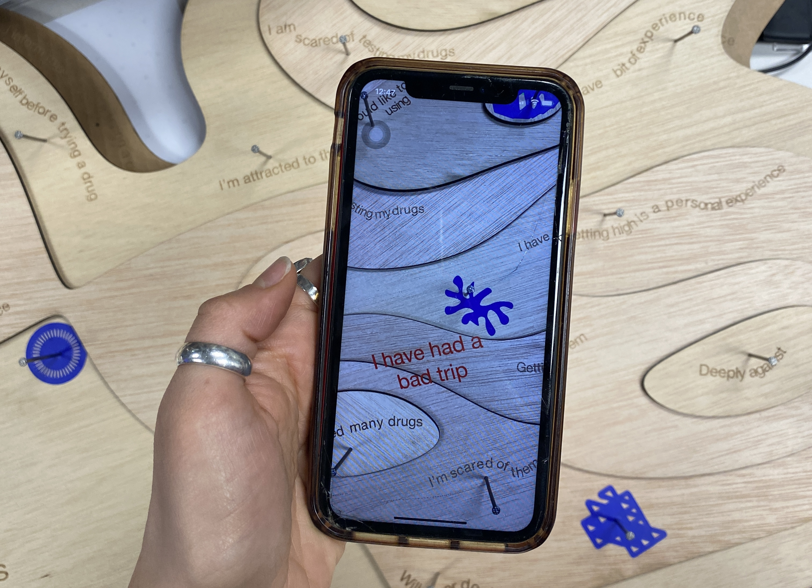

By creating a safe space for sharing personal opinions and experiences about drug use, Unfolding Conversations hopes to raise awareness about the substances in circulation, foster informed decision-making, and ultimately reduce the risk of drug-related problems in recreational environments.

### Networking

For this class we learned about the encryption of networks. During the process of establishing a wireless communication network utilizing Wifi broadcasting, we employed the ESP32 Feather development board as a key component. Our team utilized the Arduino serial monitor to input and exchange messages, allowing us to maintain seamless communication throughout the project. Once we successfully set up the system, we proceeded to connect four laptops within our classroom to the established Wifi network.

Via the MQTT (Message Queuing Telemetry Transport) protocol, we were able to facilitate efficient communication between the connected devices and the central broker. This ensured that the data being exchanged among the laptops was managed effectively and in a streamlined manner, further enhancing the overall functionality of our wireless communication system.


### 3D Printing and Scanning

3D Printing was straight-forward, as was 3D Scanning. 

**3D Model & Printing**

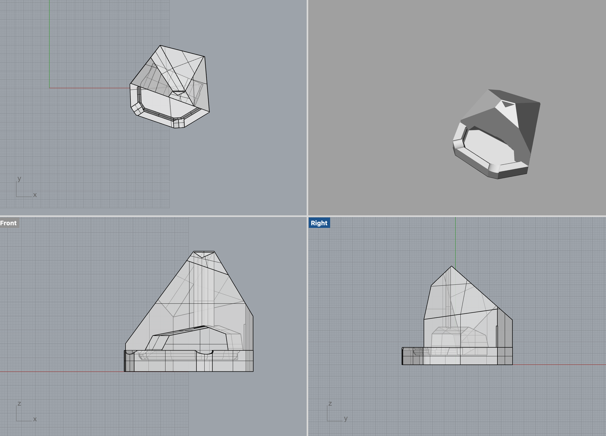

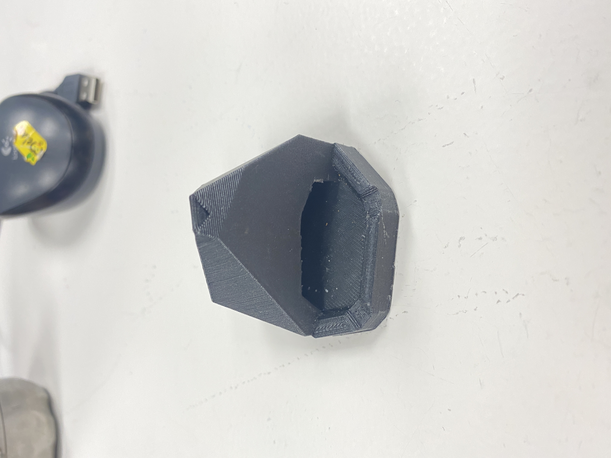

**3D Scan of Printed Model**

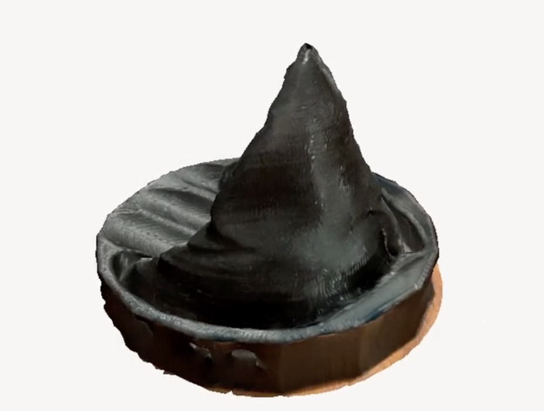

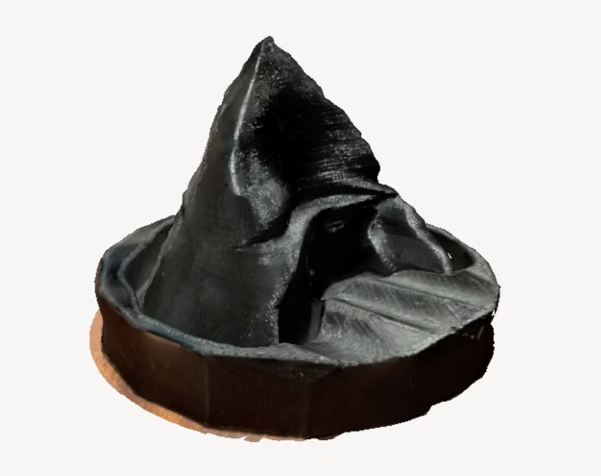

### Interfaces - Machines

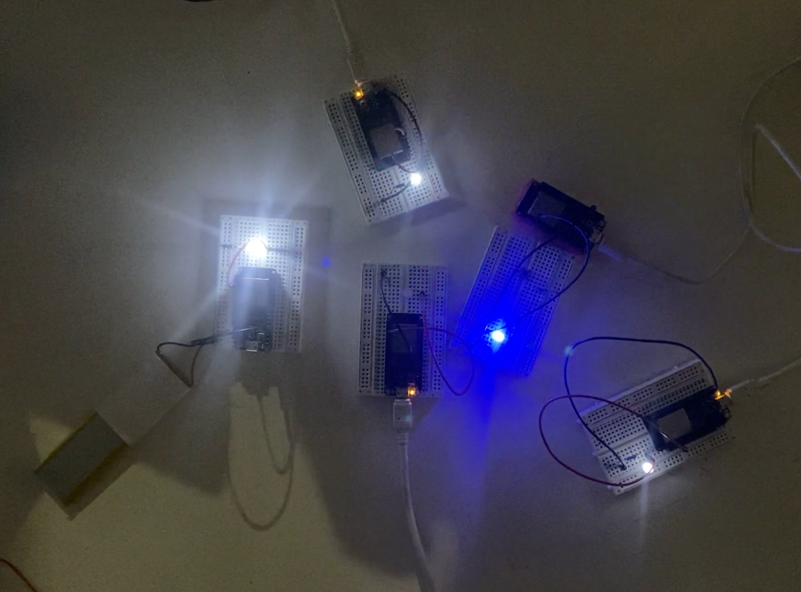

For this class, we used a remote server to simoultaneoulsy activate all the ESP Featherboards in class, resulting in a fun light show. It was very interesting to work with the remote network. The reference code provided in class allowed us to control the behavior of an LED connected to the Arduino microcontroller remotely through serial communication. By sending specific messages from the remote device, we could control the LED's blinking pattern, including the number of blinks and the speed of blinking. Overall, while I did not understand much of the specifics, the collaborative exercise was a fun way to superficially grasp the power of remote control.

```
#include "Arduino.h"
#define LED_PIN 14

// the setup function runs once when you press reset or power the board
void setup() {
  // initialize digital pin LED_BUILTIN as an output.
  pinMode(LED_PIN, OUTPUT);
  Serial.begin(9600);
}

void blink () {
  digitalWrite(LED_PIN, HIGH);   // turn the LED on (HIGH is the voltage level)
  delay(1000);                       // wait for a second
  digitalWrite(LED_PIN, LOW);    // turn the LED off by making the voltage LOW
  delay(1000);                       // wait for a second
}
void blinkFast () {
  int i=0;
  while(i<20){
    digitalWrite(LED_PIN, HIGH);   // turn the LED on (HIGH is the voltage level)
    delay(100);                       // wait for a second
    digitalWrite(LED_PIN, LOW);    // turn the LED off by making the voltage LOW
    delay(100);
    i++;    
  }                       // wait for a second
}
void blinkX (int reps) {
  int i=0;
  while(i<reps){
    digitalWrite(LED_PIN, HIGH);   // turn the LED on (HIGH is the voltage level)
    delay(100);                       // wait for a second
    digitalWrite(LED_PIN, LOW);    // turn the LED off by making the voltage LOW
    delay(100);
    i++;
  }                       // wait for a second
}

// the loop function runs over and over again forever
void loop() {

  if (Serial.available()) {
    String newMsg = Serial.readString();
    newMsg.trim();

    Serial.print("Got new message!: ");
    Serial.println(newMsg);

    // blink if we tell it to!
    if (newMsg.equals("a")){
      blink();
    }
    if (newMsg.equals("c")){
      blink();
      blink();
      blink();
    }
    if (newMsg.equals("b")){
      blink();
      blink();
    }
    if (newMsg.equals("fast")){
      blinkFast();
    }
    if (newMsg.equals("b5")){
      blinkX(5);
    }
    if (newMsg.equals("b50")){
      blinkX(50);
    }
  }
}
```

### CNC Machining

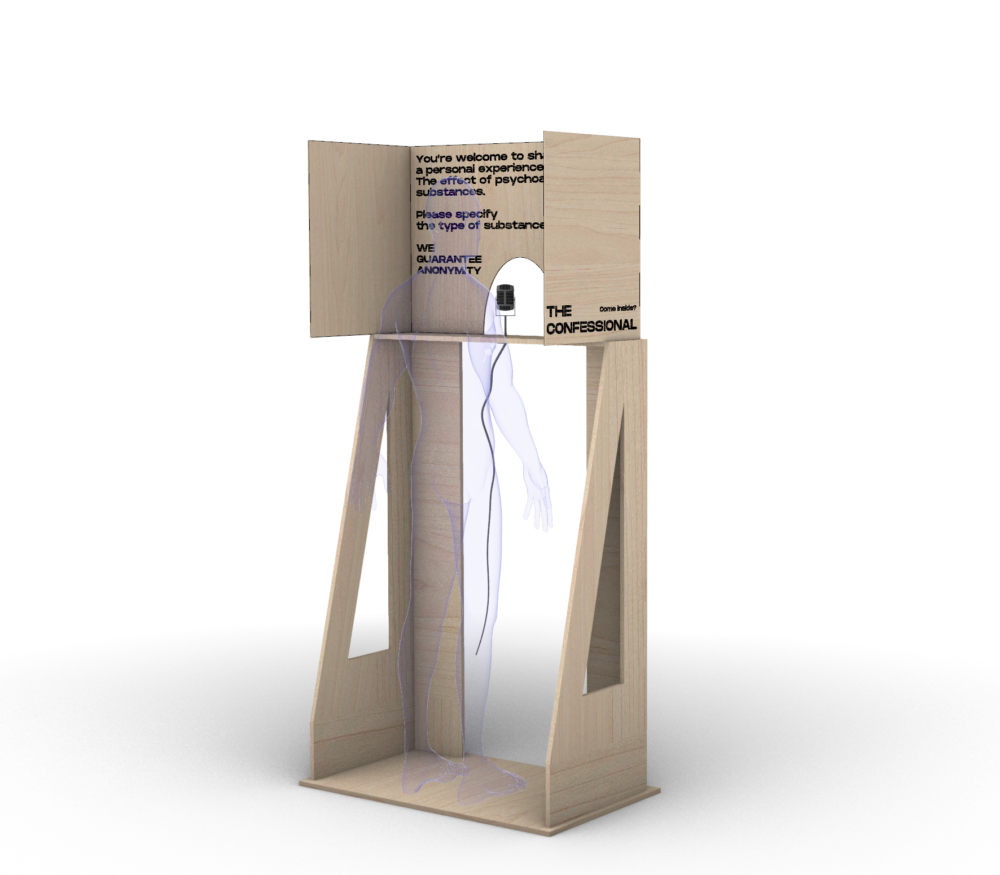

CNC machining was harder than I expected it to be. The initial phase of our process involved utilizing Rhino render to gain an understanding of the measurements and proportions required for our design. As we progressed, we made significant alterations to the design in order to accommodate the available board size and ensure that the final structure would be as lightweight as possible. 

In the second stage, we transitioned our design file to be compatible with CNC configuration. This required converting the 3D model into a 2D representation, which would ultimately facilitate the fabrication process. Given that the walls of the confessional booth would need to be securely connected, we spent considerable time devising a finger tenon joinery system to achieve this goal.

The third step of our project entailed familiarizing ourselves with the operation of the CNC machine so as ro comprehend the necessary settings and adjustments for the machine. This would theoretically ensure the accuracy and precision of our fabrication efforts.

As we delved into the complexities of the process, we encountered numerous unforeseen details and considerations that had not been evident during the 3D modeling phase. This necessitated last-minute modifications and adjustments, which, though unexpected, ultimately demonstrated the importance of recording our processes and paying attention to detail..


### Challenge 2

Repo: https://github.com/clodbe0/Microchallenge-II/edit/main/README.md

For our microchallenge II we proposed was an interactive installation that allows people to share their experiences with psychoactive substances, and a virtual reality environment that reinforces such a dialogue. 

**The confessional - an interactive installation:**

The lack of communication and dialogue around psychoactive substances often leads to a lack of awareness and information about the topic. We believe that sharing personal experiences can be a valuable tool in preventing harm to other consumers. To promote communication and comfortability, we have created The Confessional - a personal and protected space where individuals can freely and anonymously narrate their personal experiences with psychoactive substances. The Confessional is made of plywood, making it lightweight and portable.


Ideally, all the stories shared in The Confessional will then be translated into a VR experience, which we aim to exhibit at Sonar+D. We recognize that the use of substances is both literary and personal, where one's experience is only partially narrated by literature on a substance and its effects. Therefore, we believe that personal conversations are essential when discussing the topic. Unfolding Conversation thus aims to provide a safe space for people to share their experiences, creating a database of personal narratives that will be exhibited in subsequent installations. Through the power of storytelling, we hope to promote understanding, reduce stigma and discrimination, and create a more accepting and open attitude towards psychoactive substance consumption, especially in a music fest environment where people might be keener to be involved in the topic, looking for further safety and comfort. 

Key Components:

Structure: Pieces were modeled in Rhino and fabricated via laser cut and CNC (plywood). These technologies were facilitated by FabLab Barcelona.

Directional Microphone: A directional microphone allowed us to minimize unwanted background noise or interference when recording personal experiences. This provides for minimal post-processing and cleaner audio data, increasing the animation precision of the audio2face animations. While we toyed with the idea of using external microphones and a Raspberry Pi, at the time of our presentation, it did not work.

**distance measurement code**
```
#Libraries
import RPi.GPIO as GPIO
import time
 
#GPIO Mode (BOARD / BCM)
GPIO.setmode(GPIO.BCM)
 
#set GPIO Pins
GPIO_TRIGGER = 18
GPIO_ECHO = 24
 
#set GPIO direction (IN / OUT)
GPIO.setup(GPIO_TRIGGER, GPIO.OUT)
GPIO.setup(GPIO_ECHO, GPIO.IN)
 
def distance():
    # set Trigger to HIGH
    GPIO.output(GPIO_TRIGGER, True)
 
    # set Trigger after 0.01ms to LOW
    time.sleep(0.00001)
    GPIO.output(GPIO_TRIGGER, False)
 
    StartTime = time.time()
    StopTime = time.time()
 
    # save StartTime
    while GPIO.input(GPIO_ECHO) == 0:
        StartTime = time.time()
 
    # save time of arrival
    while GPIO.input(GPIO_ECHO) == 1:
        StopTime = time.time()
 
    # time difference between start and arrival
    TimeElapsed = StopTime - StartTime
    # multiply with the sonic speed (34300 cm/s)
    # and divide by 2, because there and back
    distance = (TimeElapsed * 34300) / 2
 
    return distance
 
 if __name__ == '__main__':
    try:
        while True:
            dist = distance()
            print ("Measured Distance = %.1f cm" % dist)
            if dist <= 35:
                print ("we are in the area of interest")
            time.sleep(1)
 
         Reset by pressing CTRL + C
    except KeyboardInterrupt:
        print("Measurement stopped by User")
        GPIO.cleanup()
```
  
**Microphone code**   
```
Import pyaudio
import wave
 
FORMAT = pyaudio.paInt16
CHANNELS = 1
RATE = 44100
CHUNK = 1024
RECORD_SECONDS = 5
WAVE_OUTPUT_FILENAME = "file.wav"
 
audio = pyaudio.PyAudio()
 
 start Recording
stream = audio.open(format=FORMAT, channels=CHANNELS,
                input_device_index = 1, rate=RATE, input=True,
                frames_per_buffer=CHUNK)
print ("recording...")
frames = []
 
for i in range(0, int(RATE / CHUNK * RECORD_SECONDS)):
    data = stream.read(CHUNK)
    frames.append(data)
print ("finished recording")
 
 
 stop Recording
stream.stop_stream()
stream.close()
audio.terminate()
 
waveFile = wave.open(WAVE_OUTPUT_FILENAME, 'wb')
waveFile.setnchannels(CHANNELS)
waveFile.setsampwidth(audio.get_sample_size(FORMAT))
waveFile.setframerate(RATE)
waveFile.writeframes(b''.join(frames))
waveFile.close()
```

Final Reflection: Responsible for the physical aspect of the challenge, thus putting together the confessional, it did not take long for me to realize the importance of PLANNING AHEAD and making parametric designs. Many times, we had to measure drilling holes by hand, when we could have both laser cut and measured these virtually, saving us lots of time. Same happened when 3d modelling certain insertion pieces. Overall this challenge was very important for me to realize the importance of planning (almost) every detail before trying to physically piece things together. 