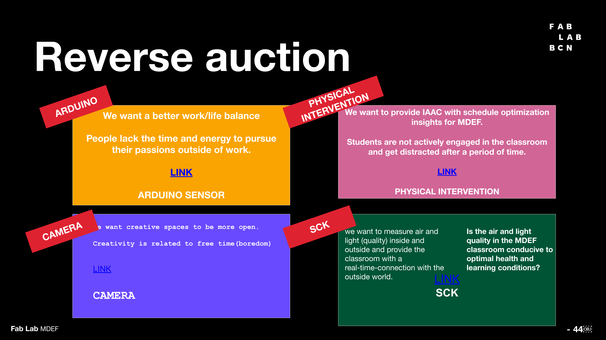

# Measuring The World

## Physical Intervention and Schedule Optimization

For this lecture series, we delved into the fascinating world of modern data capture techniques. We explored the many ways in which data can be captured, from sensors that measure changes in the physical world to structured data sets that can be accessed, connected, and modified according to our needs.

What I found most valuable about the seminar was not just the technical knowledge of how to identify, collect, store, process, and visualize data, but also the critical perspective it offered on the generation and utilization of data in contemporary data economies and infrastructures.

Our group looked into optimizing the schedule of MDEF through the use of a physical intervention. By placing lights that would randomly blink throughout the course of the class, we were hoping to identify the rate of engagemnt of our students, in comparison to the timeline of the class and its breaks.

https://hackmd.io/@cagsun/H18O_gLJh/edit

