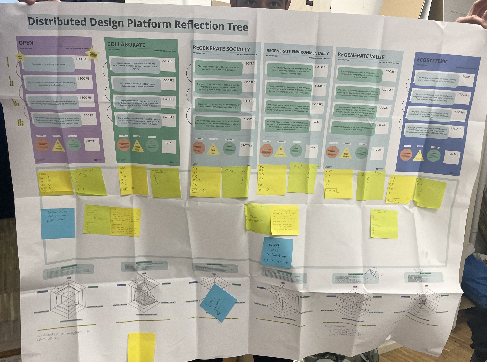
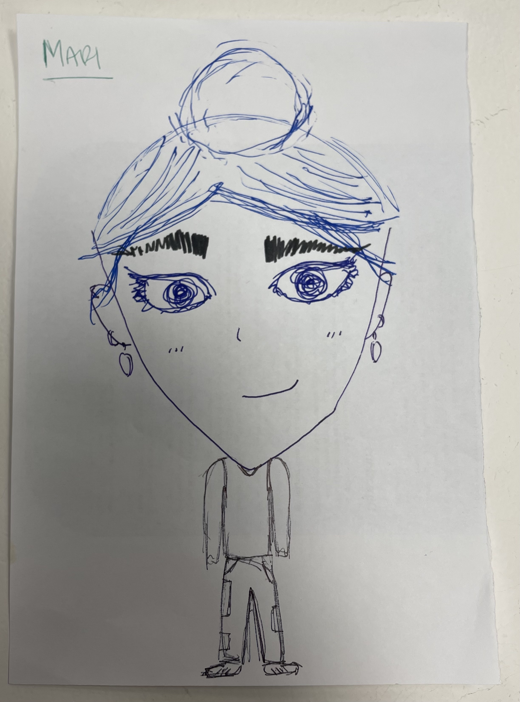
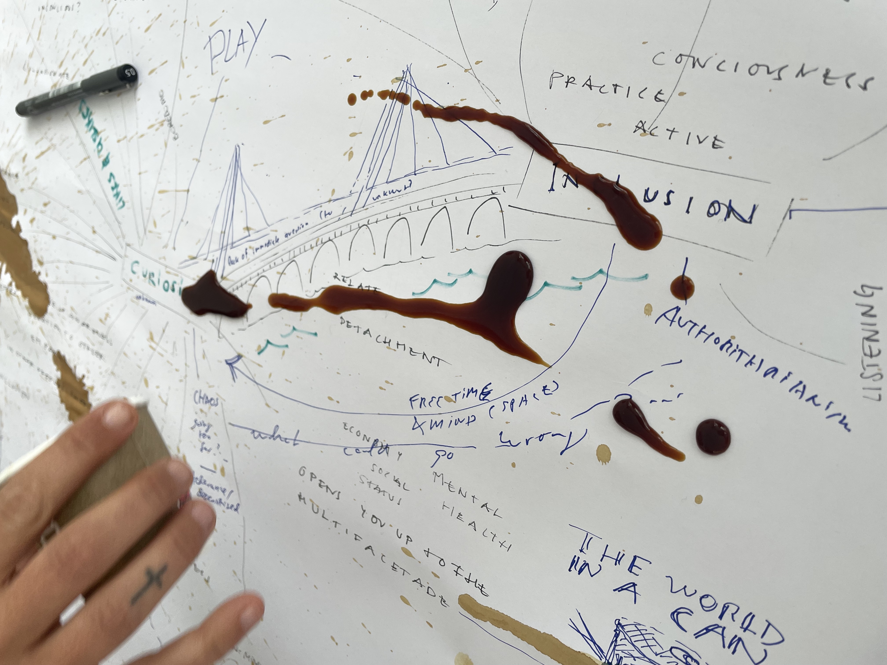
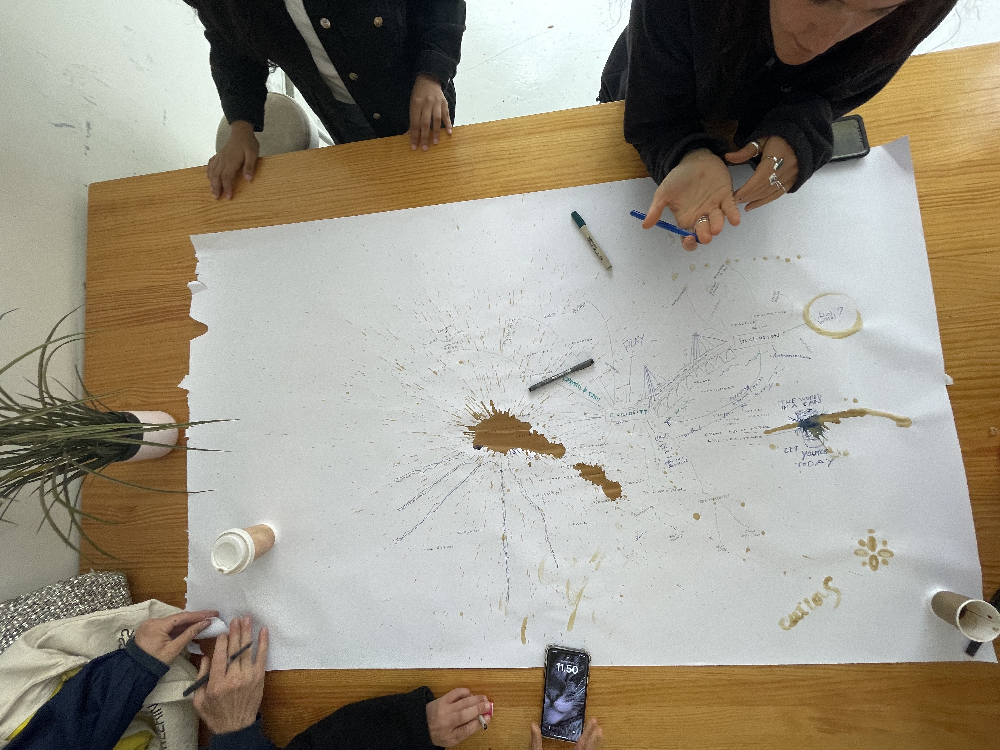
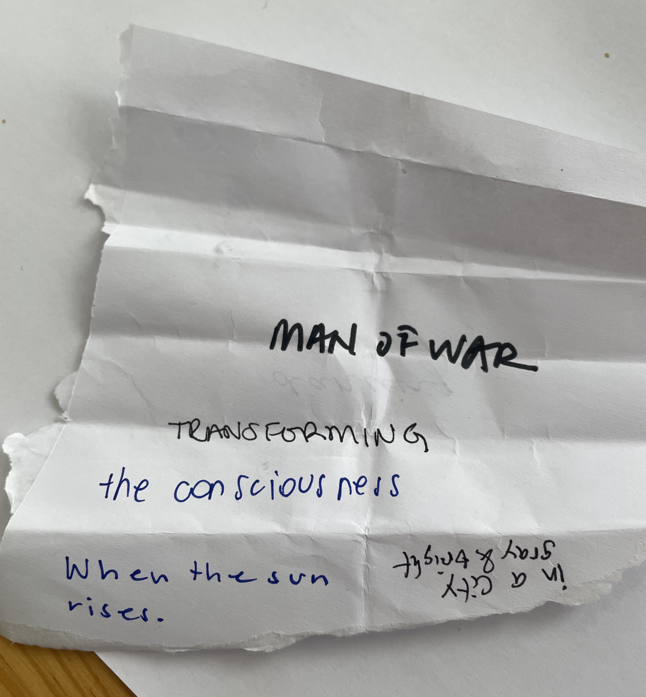

# Distributed Design

**Wednesday Session 1 - Mushroom Model**

***Learning Skills:***

***Dynamics***

***Interactions***

**Thursday Session 2 - Reflection Tree**

***Learning Skills:***

This session highlighted the points of emphasis in my intervention: tapping into ecosystemic values, and also its points of weakness: environmental regeneration. During the activity, I was required to examine both the actual status of my project and its potential status within each section. What I mean by this is that I had to evaluate how I weighed my project as according to my sense-making priorities, and also how I could potentially improve it as according to secondary objectives. In simpler words, it showed me what I had already accomplished and how could I move towards the next steps in direction of a positive impact.

***Dynamics:***

I really enjoyed my group's dynamics, particularly Korbi's reflections on the definitions of value and capital. To put it simply, he made us question whether there was really any distincition between the 'value' section of the tree, to the 'environmental' and 'social'. Values of exchange, in my opining, are in fact instrinsically tied to social-economic systems. While at first the 'value' section it seemed common-sensical to me, as I began to question its relationship to infrastructures

***Interactions:***

Very honestly my interactions did not really change my point of view, since my collegues seemed to agree with my categorization for my project as according to the different branches. What they did highlight however, was the difference in between a theoretical and actual evaluation. While I was evaluating the potentialities of my project, my colleagues invited me to look it as it was, an initial prototype. 

**Friday Session 3 - Value Presentation**

***Learning Skills:***

This session my group focused on the value of creativity. Nonethless I was able to learn a lot from every presentation, as well as from my group's collaborative brainstorming.

Collaboration:
- "Capacity for collaboration" - is it meaningful collaboration?
- Some people dont have the skills to collaborate because they were never given the chance to.
- Collaboration is dependant on power roles and position of priviledge.
- "How do you even measure that or think about that?" 
- It is about creating safe environments for people to share.
- Our biases also play a role in the means by which we collaborate. We must ask ourselves how can we collaborate without preconceptions and prior assumptions on both the project, our positionalities as collaborators, and our impacts on ecosystems.

(Social) Justice:
- When you are on top of the hierarchy, you do not see the need for justice. It is thus driven by the opressed, in most cases.
- Reparation, accountability, distribution of power.
- On a smaller scale, how can we define fairness and justice? This seems to be dependant on the futures that we hope to build for ourselves and others.
- Justice many times lies in the way that we take things for granted. We feel unjusticed when things are taken away from us.
- Justice is a "human concept". What does justice mean outside of human structures?
- "Justice is what love looks like in a public sphere" -> relationship between humanity and society

Creativity:

Our one hour conversation on creativity involved so many different aspcets, that I think outlining it is a very difficult task. Yet, we came to the conclusion that creativity is involves in our inherent beings, as methodologies for existensialism, yet also as a bridge for subsequent values such as collaboration, inclusivity, chaos, the power of listening, and so many more. 

One method that we found to instigue creativity, was to encourage everyone in class to collectively write a poem.

***Dynamics***

The dynamic was really fun and mind-opening. I really enjoyed the way that everygroup established a different format to present their values, and how everyone was exited to both comment and listen on every presentation. I also really appreciated working outside of the classroom, under the sunlight.

***Interactions***

The interaction that stood out to me the most was the portrait ice breaker. I found it very interesting how are drawing styles were drawn from our personal cultures, and how I felt in a very delicate position when picturing the figure of somewhat else. The exercise made me realize how there is great power in the act of representation.

