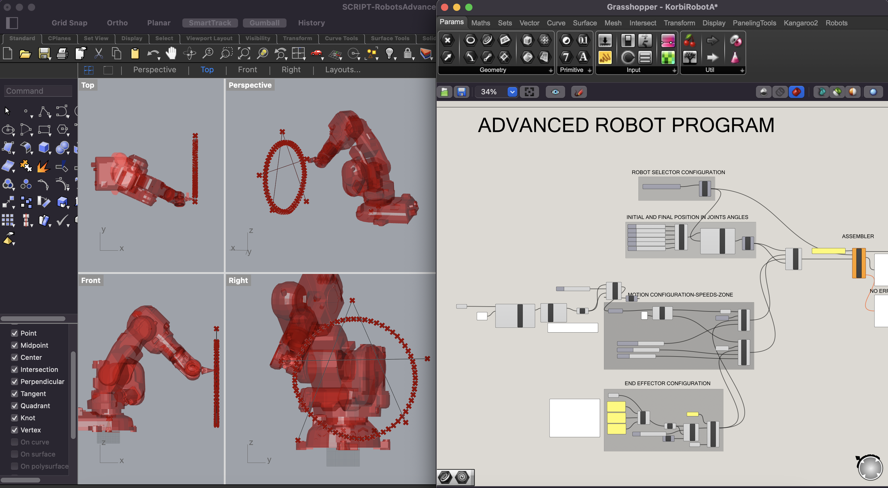

#Prototyping for Design 2.0

### **Robots**

***Task: Create a file!***

This class, we were taught both the theory and practical apsect of using a robot. The robot moves on 7 different dimensions, which can be counted by its amount of joints. Later, we were also asked to prepare the robot file. We were provided with example files to understand how to set the robot parameters:

It was really fun to play around with the robot. It was also intersting moving in the different dimensions in physical space, since I am used to modelling in virtual spaces, where you can move your viewport as acoording to the axis. 

### **Intro to Blender**

In this class Victor introduced us to his motives behind using Blender as a tool. Besides explaining the history of Blender, and how it came to be in 2004,  Victor provided a very interesting reflective note on the use of softwares, motives and limitations. He explained how the tools we choose force us towards determined paths. We are thus dependant on that which is available to us within these coices. Yet, why do the designers of a tool chose the tools they provide? Obviously, this is dependent on the motivation of the designer, and in most cases, such a motivation is capital oriented.

The class was interesting for me since I have some experience with Blender. Even though we touched on the basics, Blender is a software with myriad of ways to do the same thing, so I always enjoy watching other people's workflows. 

### **Live interfaces**

Languages: scratch (for kids), Python (quicker learning curve), C++ (better for animation, but requires time), JFTTT (internet integration), AFrame (virtual reality within the website)

langchain - framework in python to prototype ideas, works with OpenAI and Drive (check repo)

*Interaction, electronics and embodiement, Citlali Hernandez*

Live Coding: Used MAX language for live robot dance installation

It was very interesting to listen about how she engaged live coding in such interdisciplinary installations, such a embodiement, dance and art.

ALGOPOLIS 2022: different approaches to live coding. This is a project which uses coding for live music and visuals. 