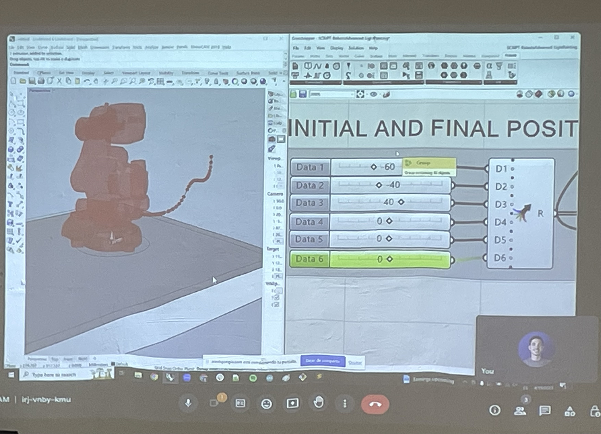

#Prototyping for Design 2.0

### Robots

***Task: Create a file!***

This class, we were taught both the theory and practical apsect of using a robot. The robot moves on 7 different dimensions, which can be counted by its amount of joints. Later, we were also asked to prepare the robot file. We were provided with example files to understand how to set the robot parameters:

It was really fun to play around with the robot. It was also intersting moving in the different dimensions in physical space, since I am used to modelling in virtual spaces, where you can move your viewport as acoording to the axis. 

