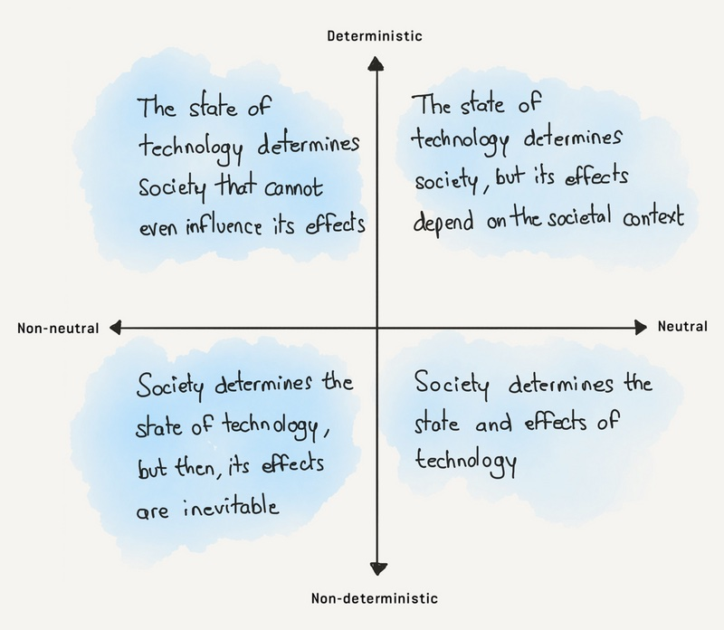
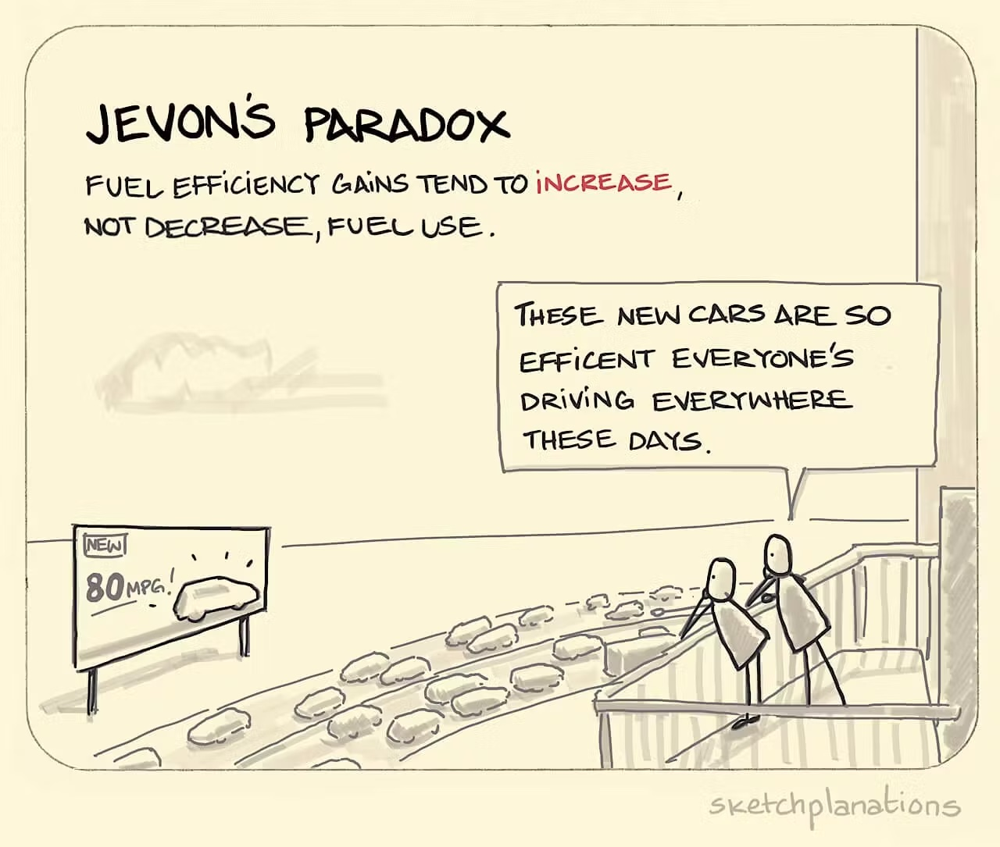

# Design Ethics

### Session 1: Ariel Guersensvaig

**A Reflection on the morality of technologies**

In this class, we talked about technology as a goal-oriented tool. These goals are then tied to moral meaning -making of social structures. On another hand, technologies was defined as "practical implementations of intelligence". At first I was skeptical about such as a definition. In my opinion, this depends on the definitions of practicality, and also for whom. What is practical to one, might be very complex to someone else. The definition of intelligence (as according to google) is "the ability to acquire and apply knowledge and skills". Yet, I do believe that not all technologies are practical aplications of knowledge. I believe that in many cases problems are created and incentivized to distort ones understanding of practicality, which in turn encourages the consumptions of such technologies. I later asked a question about it, and Ariel explained how he meant practical in the sense of objective, not convenient. Nonetheless, I liked how Ariel put it: "Technologies creates lots of problems, which create new technologies to fix them". This is a very important reflection for deigners, and the idea of neutrality.

*
"Because of their active role in the codefinition of contexts, technologies have a clear moral dimension"
*

In this section of the class we discussed technologies as extensions of the human body in both a physical and psychological sense.

*Multi-stability: No technology is just one thing.* This is a very interesting concept, and highlights the emotional context that we place onto technologies. It highlights the 

Technosolutionism: Baby video

-//-

*Nassim Parvim, Just Design: **Pasts, Presents, and Futures** (Suggested reading)*

Parvim's piece offers valuable insight into the relationship between communication, technology, and socio-technical infrastructures. The text sheds light on how technological neutrality and technological determinism play crucial roles in shaping our collective futures.

Technological neutrality asserts that technology is inherently neutral and only takes on ethical significance through human use. However, this perspective may prevent designers from considering the potential consequences of their work, resulting in the perpetuation of unjust social systems. In contrast, technological determinism assumes that technology drives social change, emphasizing the importance of responsible design choices. By recognizing the agency of designers, this perspective allows us to imagine technologies that can foster equitable futures.

However, it is important to consider the possibility that technologies, while potentially contributing to equitable futures, may also create problems that incentivize the development of even more technologies, which could be unsustainable. This perpetual cycle of problem-solving may undermine efforts to create just and sustainable societies. As designers, it is crucial to be mindful of this paradox and work towards designing not just for immediate problem-solving, but for long-term social equity and environmental sustainability.

### Session 2: Laura Benítez Valero

This lecture was very interesting, making me question most prominently the hierarchical structures that we live in, and their relationships with references to illusory “purity-driven” ideologies. 

Laura spoke of the two dimensions of power as according to Spinoza: a) Potestas, the negative and oppressive, and b) Potentia, the positive and empowering. Having studies communication, I tend to have a hard time accepting definitions. The presented definition made me question whether they fluctuate in relation to society itself, but also in reference to an individual. Here, we have to closely examine who use being empowered and who is being oppressed, considering the empowerment of one may in one way or another be seen as the oppression of another. 

I found the performance by Daniel Ortiz very powerful. The way she described how her new-born child would enter this world as an immigrant made me reflect on what sort of structure of communication this child would inherent from the nuicance of being born in another country. While I am from Brazil, and I am currently struggling to find means to continue in Barcelona after my studies since I do not have a “preferable visa”, I was nonetheless born and raised in a country where I have privilege. This means that, while I do see inherent traits belonging to the explicitly sexist institutions of the Brazilian culture, and in many times a detachment from my ownership of my female body, I have never felt a detachment from the places which I transited. The performance was very mind-opening as Ortiz explicitly drew Spanish blood into her own body to free her child from restrictions and inherent traits of the non-belonging. It played on the right to be. Having said that, I think this also adds to our class discussion on the controversial statement “I would not wish an identity upon anyone”. Those who have the power to claim that, I believe, have never been restricted from their identities. In Ortiz’s child’s case for example, they will be stripped of their right to choose an identity from birth, and rather defined as the “immigrant”. 

Now, we question epistemic violence. When we speak of epistemology thus knowledge production, we must question who are those responsible for shaping knowledge? It reminded me of the dawn of everything by David Kroeber, where they speak of the enlightenment and European knowledge as a direct response to oppressed indigenous knowledge, yet shaped as enlightened new discoveries. It is also. Important to ask ourselves, in which language are these knowledge systems being built? 