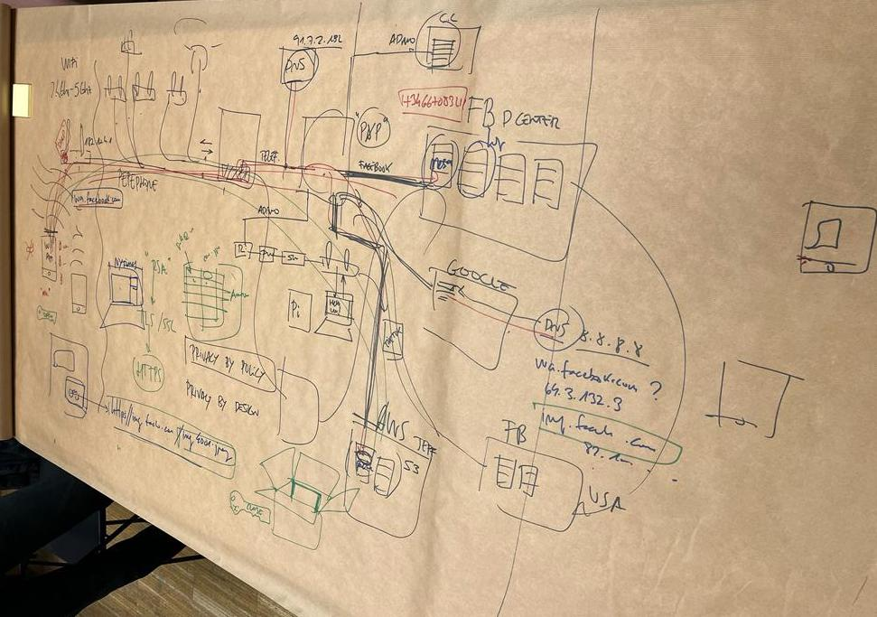

# Decentralized Autonomous Organizations

Guillem was the guide for our initial foray into the universe of digital protocols and formats. His opening question to us was an intriguing one: "Upon hearing 'bitcoin', 'NFTs', 'blockchain', what is your immediate reaction?" While I am interested in the topic, my intial reaction was nonetheless skeptical, especially in terms of NFTs. 

Nevertheless, as our educational journey continued, I observed a transformation in my understanding of these novel technologies. If asked by Guillem now, I would describe these advancements as emerging conduits for commerce, developed by collective efforts to revamp the existing narratives and design protocols that align with the ever-evolving digital landscape.

Following this, we embarked on a deeper exploration of web3 and NFTs, featuring lively debates and hands-on activities. Among our initial undertakings was the creation of a virtual wallet, named 'TEMPLE'. We expanded our knowledge base with a study of TEZOS and took a step towards practical application by crafting and uploading a token image to OBJKT WEB. We even had the chance to engage in a simulated buying and selling exercise among ourselves.

It was during these activities that I began to reconcile with my initial skepticism, particularly surrounding NFTs. The hands-on experience of creating and interacting with these digital assets provided valuable insights into their real-world applications and potential benefits.

It was during these explorations that Claudia and I conceptualized the idea of a bio-algorithmic NFT. As a collective of digital artists, we are passionately intrigued by the fusion of technology and human biology. We then envisioned an innovative project that harnesses bio-tracking data, such as heart rate, to craft dynamic digital sculptures. Our ambition is to capture the unique physiological signatures of individuals and translate them into personalized pieces of digital art—akin to an evolving, visual echo of a person's biological state. These creations would not be static; but responsive and alive, adapting in real-time based on bio-feedback from devices like Apple watches.

In speculation, we see an untapped opportunity to redefine the concept of creation and ownership in the digital art space. The sculptures we design aren't just static pieces of digital art; they are "living" NFTs. Each token, each sculpture, is intimately tied to its owner, evolving in harmony with their biological rhythm. It's more than just a digital asset—it becomes a unique, digital reflection of the owner's physiological state. Heart rate data influences the color, texture, and shape of the NFT, adding a deeply personal dimension to these digital tokens. Within the web3 ecosystem, these living sculptures can be traded, displayed, and owned, broadening the impact of our art and challenging traditional modes of engagement with digital art. We envision this project as a pioneering pathway to self-expression and interconnection, merging the digital and physical in a previously unexplored manner.

