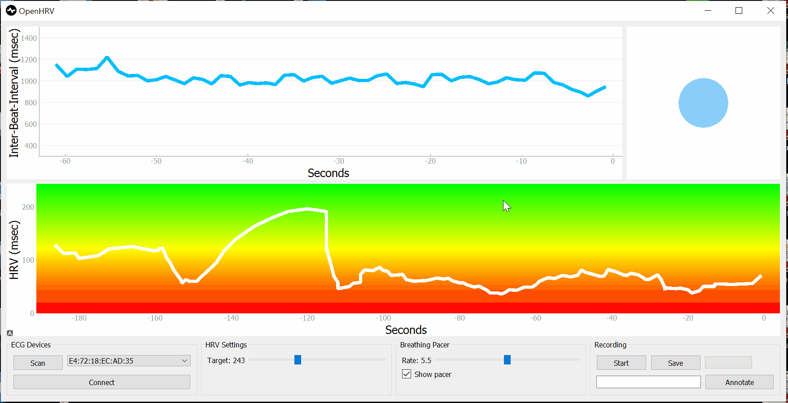
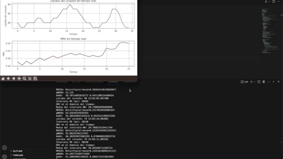
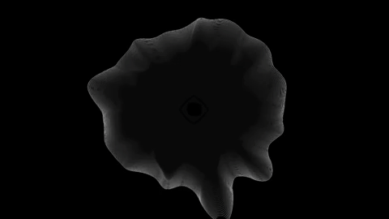
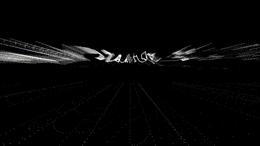

# MicroChallenge III

Repo: https://github.com/mdhelomme/MicroChallengeIII

### HRV and Conceptualizing Quantified Data

When we embarked on this journey, little did we know that it would lead us to a profound exploration of our bodies, our emotions, and the importance of truly listening to ourselves. Our shared passions for mental and physical well-being, combined with a holistic perspective on wellness, ignited a captivating conversation that opened our eyes to the wisdom our bodies hold.

Motivated by this newfound realization, we dared to dream big and set out to create something extraordinary—a biofeedback device that could help us decode the intricate language of our nervous systems. Our mission was simple yet ambitious: to empower individuals with the tools to enhance their well-being by understanding and responding to the signals their bodies constantly send.

Imagine if we could visualize the expressions of our nervous systems, decode their messages, and use that knowledge to shape our physical and mental states. With this vision in mind, we set out to build a model that would bring to life the concept of Heart Rate Variability (HRV)—the fluctuations in the time intervals between our heartbeats. These fluctuations are a reflection of the delicate balance or imbalance within our nervous systems.

Our goal was clear—to create a real-time visualization of HRV and enable individuals to achieve balance and harmony within themselves. To achieve this, we collected heart rate data using ECG sensors, calculated HRV values, and transformed this information into interactive and engaging visualizations. We wanted to guide users in understanding their own bodily states, empowering them to navigate towards states that bring them greater well-being.

HRV analysis, at its core, provides valuable insights into an individual's physiological state, their autonomic nervous system functioning, stress levels, and overall health. It has found applications in medical and research settings, sports science, and other domains where objective measurements and data-driven analysis hold great significance.

**But why do we believe in this approach so strongly?**

Our ultimate goal is to find equilibrium and embrace the flow of life. To achieve this, we must honor our bodies' innate wisdom and attentively respond to the signals they send us.

We propose embracing biohacking techniques that optimize our nervous systems, focusing on cultivating relaxation rather than staying in a constant state of high alertness. This shift in mindset can significantly enhance our overall well-being.

Resonance frequency breathing, an effective method we advocate, allows us to find this balance. By harmonizing our breath with our heart rate, we enter a state known as coherence—a state that amplifies HRV and paves the way towards the desired equilibrium and flow.

Through the application of this biofeedback technique, we can make more informed decisions about our well-being. While HRV data analysis traditionally revolves around algorithmic measurements, we believe there's more to explore. We strive to integrate HRV analysis with visual art, aiming for a more comprehensive, accessible, and holistic understanding of an individual's emotional and empathetic state.

### Installation: The Data Sculpture

Our primary objective is to design an immersive visual experience that brings real-time data to life in a deeply personal way. We envision projecting the visual data collected onto a wall, creating a tangible and impactful data sculpture. Alternatively, we could display these visualizations on screens, maintaining the immersive quality.

By transforming abstract data into tangible visual representations, we aim to engage viewers on a profound level, making complex information accessible and leaving a lasting impact.

**TouchDesigner**

TouchDesigner, a remarkable node-based visual programming language developed by the Canadian software company Derivative, serves as our creative ally. It enables us to craft real-time, interactive visuals, 3D animations, and immersive multimedia experiences. Widely recognized for its flexibility and extensive capabilities, TouchDesigner finds its place in professional settings such as live performances, interactive installations, music videos, and digital prototyping.

One of TouchDesigner's greatest strengths lies in its ability to handle different types of data, convert between them, and seamlessly combine them. This versatility empowers us to design interactive experiences and installations with boundless creativity.

In our project, we utilized data recorded from the POLAR10, transforming the raw input into a conceptual art piece. While our focus was on artistic expression rather than a comprehensive understanding of the data, the outcome was undeniably captivating.

**Python**

Python played a vital role in accessing and analyzing data from the PolarH10 sensor, providing us with accurate HRV values. By utilizing the Bleak library, a Python library for connecting with BLE devices, we established a connection to the PH10 sensor. We then employed the PyHRV library to calculate RR peaks and HRV values. The process was not without its challenges, as the sensor data required calibration, extensive testing, and careful consideration to achieve the desired results.

For a comprehensive overview of our Python work, you can explore our repository here: https://github.com/ServirGt/Biosensing
